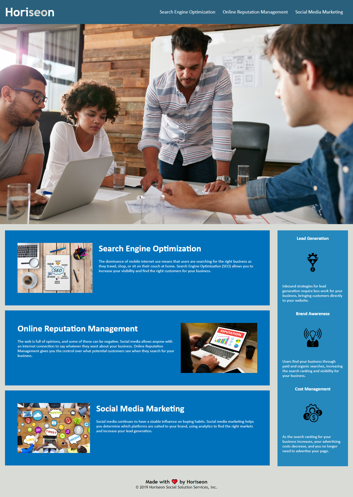

# Horiseon
bootcamp week 1 challenge

## Purpose
This is a webpage that promotes the company Horiseon Social Solution Services, Inc.  They provide search engine optimization, online reputation management, and social media marketing.
The purpose of this refactor was to provide a codebase that follows accessibility standards so that the site is optimized for search engines.  I went through the code and changed semantic elements
so that they better match the content that they provide.  I provided alt descriptions for images to accomodate the use of screen reader technology.  I also consolidated the CSS for the webpage and
added comments to easily locate CSS rules.

## Link to the deployed application
https://srwagner916.github.io/horiseon/

## Link to GitHub repository
https://github.com/srwagner916/horiseon

## Screenshot of Webpage

## Contribution
Refactor by Shay Wagner